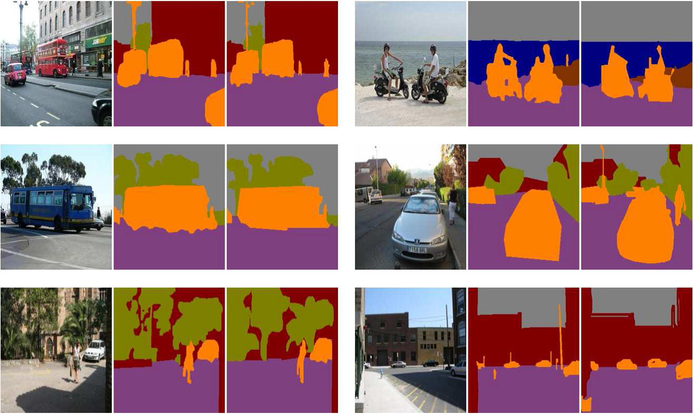

ImplementOfPatchMatchGraph
==========================

Check tools for PatchMatchGraph: Building a Graph of Dense Patch Correspondences for Label Transfer
The function __accuracy_test()__ is used to caculate the accuracy of result by compare the output labeled image matrix with the ground truth matrix.
Input: 
true_class_matrix, the original image
result_matrix, the result image from author’s paper

Output:
class_name, number of class
base_num_list, the count of specific class corresponding to the class_name

Usage:
[class_name base_num_list  error_num_list accuracy_rate] = accuracy_test(true_class_matrix,result_matrix);

Introduction:
Like image show below, this function is used to get the different of labeled result with the ground truth labeled one.

Example:

True_class_matrix
5	1	4	3	4	2	1	4	1	1	3
5	3	1	3	2	1	1	2	5	5	1
1	5	2	4	3	2	3	4	1	3	5
5	4	1	4	4	4	4	4	4	3	5
4	5	1	4	5	3	5	4	5	1	3
1	4	5	2	5	2	1	3	5	5	3
2	1	4	4	3	5	3	1	1	4	2
3	5	2	4	1	3	3	2	2	2	5
5	5	5	1	1	3	1	5	2	3	2
5	4	1	1	2	5	2	1	5	3	1
1	4	3	3	5	2	1	5	3	1	4
5	4	2	5	2	4	4	3	5	2	2
5	2	4	2	5	4	2	5	1	1	2
3	4	4	3	2	2	3	1	2	1	3
5	1	1	2	5	3	1	3	1	2	1

Result_matix
5	1	4	3	4	2	1	4	1	1	3
5	3	1	3	2	1	1	2	5	5	1
1	5	2	4	3	2	3	4	1	3	5
5	4	1	4	4	4	4	4	4	3	5
4	5	1	4	5	3	5	4	5	1	3
1	4	5	2	5	2	1	3	5	5	3
2	1	4	4	3	5	3	1	1	4	2
3	5	2	4	1	3	3	2	2	2	5
5	5	5	1	1	3	1	5	2	3	2
5	4	1	1	2	5	2	1	5	3	1
1	4	3	3	5	2	1	5	3	1	4
5	4	2	5	2	4	4	3	5	2	2
5	2	4	2	5	4	2	5	1	1	2
3	4	4	3	2	2	3	1	2	1	3
5	1	1	2	5	3	1	3	1	2	1

Command: run demo

Output:
class_1 has number:38, error: 1, the accuracy rate: 0.97368
class_2 has number:31, error: 0, the accuracy rate: 1
class_3 has number:30, error: 1, the accuracy rate: 0.96667
class_4 has number:30, error: 0, the accuracy rate: 1
class_5 has number:36, error: 2, the accuracy rate: 0.94444
